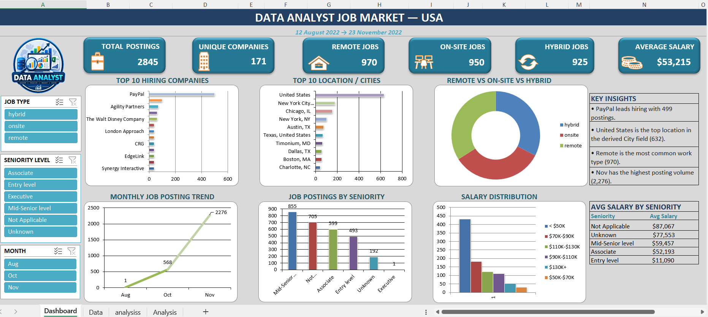
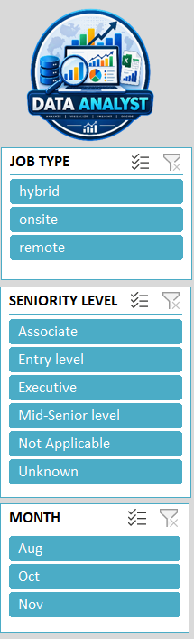
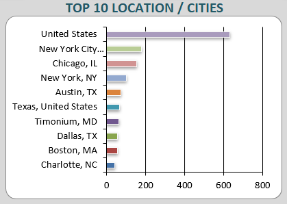
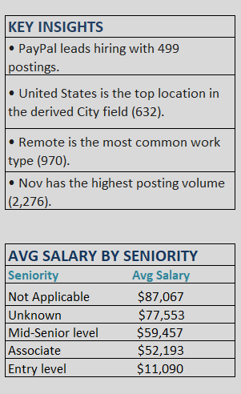

# USA_Data_Analyst_Job_Market_Excel_Dashboard
Interactive USA Data Analyst Job Market Dashboard built in Microsoft Excel using Pivot Tables, Pivot Charts, Slicers, KPI Cards, and Data Visualization.
# 📊 Data Analyst Job Market Dashboard — USA

An interactive **Microsoft Excel Dashboard** built to analyze the Data Analyst job market in the USA. The dashboard provides insights into job postings, hiring companies, locations, work types, seniority levels, salary distribution, and hiring trends.

---

## 🖼️ Dashboard Preview



---

## 📌 Project Overview

This project focuses on analyzing **Data Analyst job postings across the USA** using Microsoft Excel.

Raw job posting data was transformed into an interactive dashboard using **Pivot Tables, Pivot Charts, Slicers, KPI Cards, Excel formulas, and data visualization techniques**.

The dashboard helps identify hiring patterns, popular locations, work preferences, seniority requirements, salary ranges, and overall job market trends.

### 📅 Dataset Period

**12 August 2022 → 23 November 2022**

---

## 📊 Key Performance Indicators


| KPI | Value |
|---|---:|
| 💼 Total Job Postings | 2,845 |
| 🏢 Unique Companies | 171 |
| 🏠 Remote Jobs | 970 |
| 🏢 On-Site Jobs | 950 |
| 🔄 Hybrid Jobs | 925 |
| 💰 Average Salary | $53,215 |

---

## 🎛️ Interactive Dashboard



The dashboard includes interactive Excel Slicers that allow users to filter the analysis by:

### Job Type
- Hybrid
- On-Site
- Remote

### Seniority Level
- Associate
- Entry Level
- Executive
- Mid-Senior Level
- Not Applicable
- Unknown

### Month
- August
- October
- November

The charts and KPI cards dynamically update based on the selected filters.

---

## 📈 Dashboard Analysis

### 🏢 Top Hiring Companies

The dashboard identifies the leading companies with the highest number of Data Analyst job postings, helping understand which organizations are actively hiring.

### 📍 Top Locations / Cities



The location analysis highlights the areas with the highest concentration of Data Analyst opportunities.

**United States** appears as the leading location in the derived City field with approximately **632 postings**.

### 🌎 Work Type Analysis

The dashboard compares three major work arrangements:

- Remote
- On-Site
- Hybrid

This provides an overview of how Data Analyst opportunities are distributed across different working arrangements.

### 📅 Monthly Job Posting Trend

The monthly trend visualization shows changes in job posting volume during the selected period, with **November recording the highest posting volume**.

### 👔 Job Postings by Seniority

Job postings are analyzed across different seniority levels, including:

- Mid-Senior Level
- Not Applicable
- Associate
- Entry Level
- Unknown
- Executive

### 💰 Salary Distribution

The salary distribution chart categorizes job postings into different salary ranges to understand the overall salary structure of the Data Analyst job market.

---

## 💡 Key Insights



The dashboard highlights several important findings:

- **PayPal** leads the hiring companies with approximately **499 job postings**.
- **United States** is the top location in the derived City field with approximately **632 postings**.
- **Remote** is the most common work type with **970 job postings**.
- **November** has the highest posting volume with approximately **2,276 postings**.
- **Mid-Senior Level** has the highest number of job postings among the seniority categories.

---

## 💰 Average Salary by Seniority

| Seniority Level | Average Salary |
|---|---:|
| Not Applicable | $87,067 |
| Unknown | $77,553 |
| Mid-Senior Level | $59,457 |
| Associate | $52,193 |
| Entry Level | $11,090 |

---

## 📊 Visualizations Included

The dashboard contains:

- 📊 Top 10 Hiring Companies
- 📍 Top 10 Locations / Cities
- 🍩 Remote vs On-Site vs Hybrid Analysis
- 📈 Monthly Job Posting Trend
- 📊 Job Postings by Seniority
- 💰 Salary Distribution
- 📋 Average Salary by Seniority
- 🎯 Dynamic KPI Cards
- 🎛️ Interactive Slicers
- 💡 Key Insights Panel

---

## 🛠️ Tools & Techniques Used

### Tools
- Microsoft Excel

### Techniques
- Data Cleaning
- Data Transformation
- Pivot Tables
- Pivot Charts
- Excel Slicers
- KPI Cards
- Excel Formulas
- Conditional Formatting
- Data Visualization
- Dashboard Design
- Business Insights

---

## 📂 Project Structure

```text
📦 USA_Data_Analyst_Job_Market_Excel_Dashboard/
│
├── 📊 USA-Data-Analyst-Job-Market-Dashboard.xlsx
├── 🖼️ dashboard.png
├── 🖼️ kpi-cards.png
├── 🖼️ slicers.png
├── 🖼️ insights.png
├── 🖼️ hiring-location-analysis.png
└── 📄 README.md
```

🎯 Project Objective

The objective of this project was to build an interactive Excel-based analytical dashboard that converts raw job posting data into meaningful and easy-to-understand insights.

This project demonstrates practical skills in:

Data Analysis
Excel Dashboard Development
Data Cleaning
Pivot Table Analysis
Data Visualization
Interactive Reporting
KPI Development
Business Insight Generation
📌 Key Takeaways

This dashboard provides a consolidated view of the USA Data Analyst job market and helps answer questions such as:

Which companies are hiring the most Data Analysts?
Which locations have the highest number of opportunities?
What is the distribution of Remote, On-Site, and Hybrid jobs?
Which seniority level has the most job postings?
How are job postings distributed across salary ranges?
How does job posting volume change over time?
How does average salary vary by seniority level?
## 👨‍💻 Author
## 👨‍💻 PRATAP SINGH RANAWAT

## Data Analyst | Microsoft Excel | SQL | Python | Data Visualization

## 📌 GitHub Profile: https://github.com/Pratapsingh781

## ⭐ If You Like This Project

If you found this project useful or interesting, consider giving the repository a ⭐.

Your feedback and support are greatly appreciated!

## 🙏 Thank You

Thank you for taking the time to explore this project.

I hope this dashboard provides a clear and useful view of the USA Data Analyst Job Market and demonstrates the practical application of Excel for data analysis and visualization.

## Thank you for visiting! 🚀
